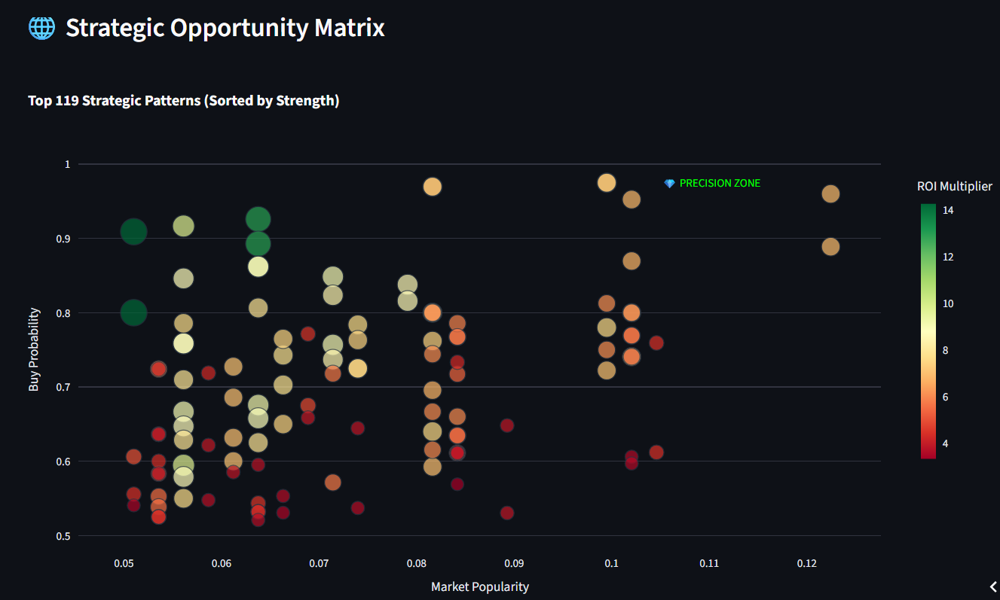
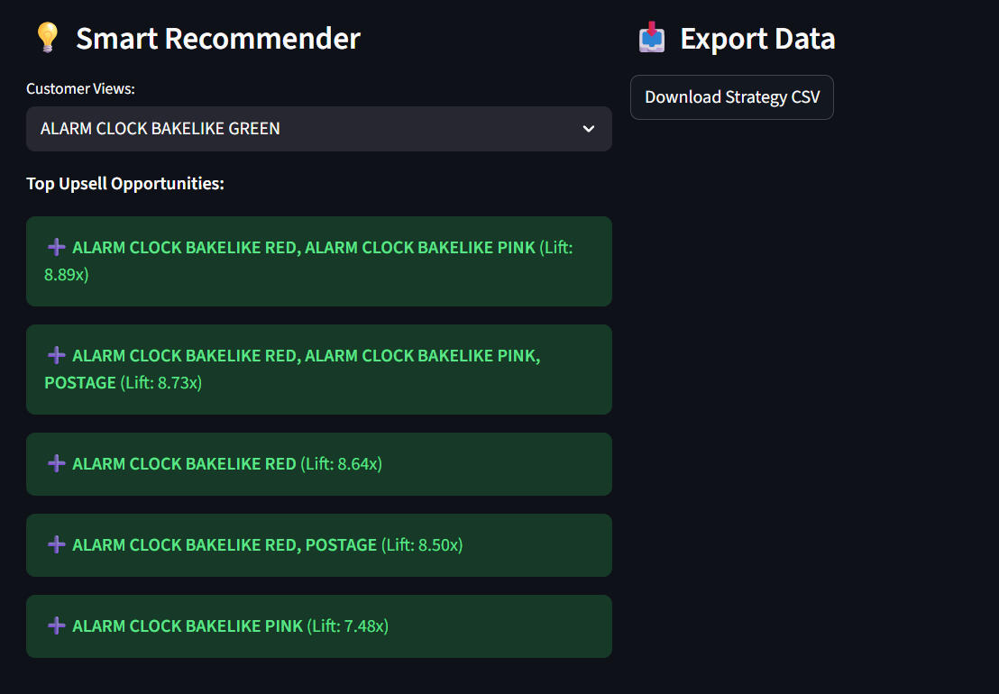

# 🛒 Retail Strategy & Market Basket Optimizer

**A Prescriptive Analytics Engine for Maximizing Cross-Sell Revenue**

**🔴 Live Application:** [Launch Dashboard](https://vighnesh-shetty-vs-market-basket-analy-market-basket-app-iv8ny8.streamlit.app/)

[](https://www.python.org/downloads/release/python-3100/)
[](https://streamlit.io)
[](https://github.com/rasbt/mlxtend)

This project moves beyond simple data visualization to provide an **Executive Decision Support System**. It utilizes the **FP-Growth Algorithm** to analyze over 500,000 transactions, identifying high-value product bundles that directly increase **Average Order Value (AOV)**.

---

## 🚀 Business Impact & ROI

The goal of this platform is to translate raw transactional data into actionable merchandising strategies.

* **📈 Cross-Sell Optimization:** Identifies products with high **Lift (Multiplier)** to create data-driven "Bundle Deals" (e.g., "Retro Collection Packs").
* **🛒 Frictionless Upselling:** Provides high-certainty recommendations (High Confidence) for "You May Also Like" website widgets.
* **🧠 "Collector" Psychology:** successfully detects niche purchasing behaviors, such as customers completing specific product sets (e.g., matching novelty tins).

---

## 💡 Case Study: The "Retro Kid" Insight (France Market)

During analysis of the French market, the model identified a massive opportunity in the **Novelty Gifts** category that manual analysis missed.

| Anchor Product | Recommended Add-On | Lift (Multiplier) | Strategic Action |
| :--- | :--- | :--- | :--- |
| **Plasters in Tin Spaceboy** | **Plasters in Tin Woodland** | **24.5x** | Create "Retro First Aid" Bundle |
| **Set/6 Red Spotty Paper Cups** | **Set/6 Red Spotty Paper Plates** | **18.2x** | Automate "Party Pack" upsell at checkout |

**The Insight:** Customers buying one design are **24x more likely** to buy the matching set. By bundling these automatically, we reduce search friction and capture revenue that might otherwise be lost.

---

## 🛠️ Technical Architecture

This project was engineered for performance and scalability, handling large datasets that typically crash standard algorithms.

### 1. High-Performance Mining
* **FP-Growth vs. Apriori:** Switched to the **Frequent Pattern Growth** algorithm to eliminate the need for candidate generation, significantly reducing computational cost.
* **Sparse Matrix Optimization:** Implemented `TransactionEncoder` with `sparse=True` to handle massive datasets without MemoryErrors.
* **Boolean Typecasting:** Converted data to boolean arrays to reduce memory footprint by **8x** compared to standard integer matrices.

### 2. Executive Visualization (Plotly)
* **Strategic Opportunity Matrix:** A custom bubble chart that maps **Popularity** (Support) vs. **Certainty** (Confidence), utilizing color thresholds to highlight "Precision Targets" for the business team.

---

## 📸 Dashboard Previews

### 1. The Strategic Opportunity Matrix
*Visualizing the "Precision Zone" where high-certainty automation should occur.*


### 2. The Smart Recommendation Engine
*Real-time upsell predictions based on selected products.*


---

## 💻 Installation & Usage

1.  **Clone the Repository**
    ```bash
    git clone [https://github.com/YOUR_USERNAME/Retail-Strategy-Optimizer.git](https://github.com/YOUR_USERNAME/Retail-Strategy-Optimizer.git)
    cd Retail-Strategy-Optimizer
    ```

2.  **Install Dependencies**
    ```bash
    pip install -r requirements.txt
    ```

3.  **Run the Application**
    ```bash
    streamlit run market_basket_app.py
    ```

---

## 📂 Project Structure

```text
├── market_basket_app.py   # Main Streamlit Application
├── requirements.txt       # Python Dependencies
├── data/
│   └── OnlineRetail.csv   # Dataset (sourced from Kaggle)
├── assets/                # Screenshots for README
└── README.md              # Project Documentation
